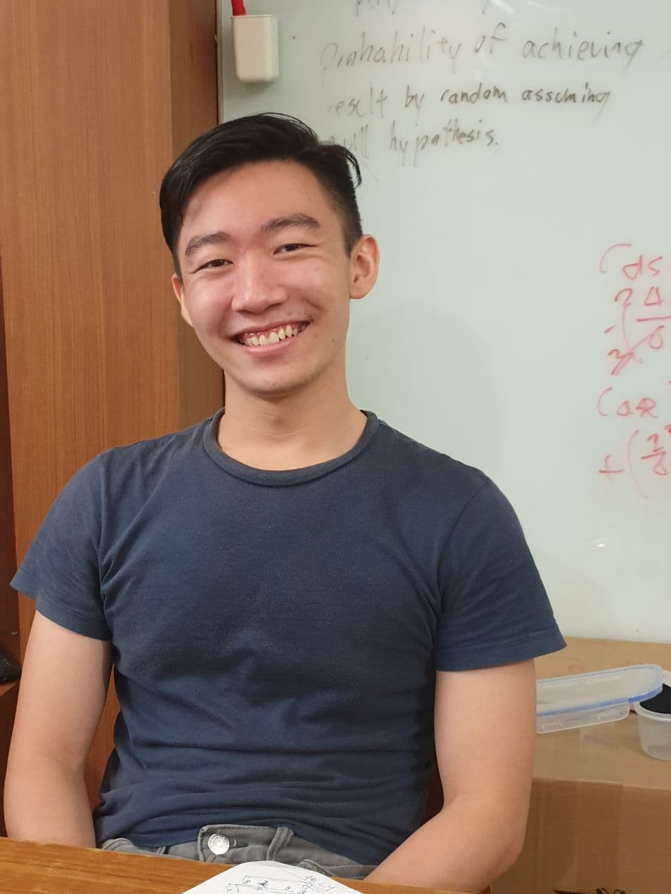
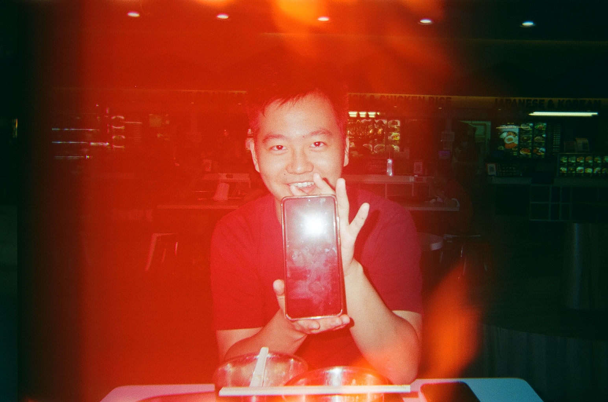

We are a team based in the [School of Computing, National University of Singapore](http://www.comp.nus.edu.sg).

You can reach us at the email `seer[at]comp.nus.edu.sg`

## Project team

### John Doe

[[homepage](http://www.comp.nus.edu.sg/~damithch)]
[[github](https://github.com/johndoe)]
[[portfolio](team/johndoe.md)]

* Role: Project Advisor

### Jane Doe

[[github](http://github.com/johndoe)]
[[portfolio](team/johndoe.md)]

* Role: Team Lead
* Responsibilities: UI

### Johnny Doe

[[github](http://github.com/johndoe)] [[portfolio](team/johndoe.md)]

* Role: Developer
* Responsibilities: Data

### Jean Doe

[[github](http://github.com/johndoe)]
[[portfolio](team/johndoe.md)]

* Role: Developer
* Responsibilities: Dev Ops + Threading

### Rishabh Anand

[[github](http://github.com/rish-16)]
[[portfolio](team/rishabh.md)]

* Role: Developer
* Responsibilities: Integration, Backend

### Gabriel Goh

[[github](http://github.com/gycgabriel)]
[[portfolio](team/gycgabriel.md)]

* Role: Developer
* Responsibilities: Scheduling and Tracking

### Yu Xin

[[github](https://github.com/huyuxin0429)]
[[portfolio](team/huyuxin0429.md)]

* Role: Developer
* Responsibilities: Testing

### Didymus

[[github](https://github.com/didymental)]
[[portfolio](team/didymus.md)]

* Role: Developer
* Responsibilities: Documentation, Deliverables and deadlines
