* Table of Contents
  {:toc}

---

## **Acknowledgements**

* Libraries used: [JavaFX](https://openjfx.io/), [Jackson](https://github.com/FasterXML/jackson), [JUnit5](https://github.com/junit-team/junit5)

---

## **Setting up, getting started**

Refer to the guide [_Setting up and getting started_](SettingUp.md).

---

## **Design**

<div markdown="span" class="alert alert-primary">


:bulb: **Tip:** The `.puml` files used to create diagrams in this document can be found in the [diagrams](https://github.com/AY2122S1-CS2103-W14-1/tp/tree/master/docs/diagrams/) folder. Refer to the [_PlantUML Tutorial_ at se-edu/guides](https://se-education.org/guides/tutorials/plantUml.html) to learn how to create and edit diagrams.
</div>

### Architecture


The ***Architecture Diagram*** given above explains the high-level design of the App.

Given below is a quick overview of main components and how they interact with each other.

**Main components of the architecture**

**`Main`** has two classes called [`Main`](https://github.com/AY2122S1-CS2103-W14-1/tp/tree/master/src/main/java/seedu/docit/Main.java) and [`MainApp`](https://github.com/AY2122S1-CS2103-W14-1/tp/tree/master/src/main/java/seedu/docit/MainApp.java). It is responsible for,
* At app launch: Initializes the components in the correct sequence, and connects them up with each other.
* At shut down: Shuts down the components and invokes cleanup methods where necessary.

[**`Commons`**](#common-classes) represents a collection of classes used by multiple other components.

The rest of the App consists of four components.

* [**`UI`**](#ui-component): The UI of the App.
* [**`Logic`**](#logic-component): The command executor.
* [**`Model`**](#model-component): Holds the data of the App in memory.
* [**`Storage`**](#storage-component): Reads data from, and writes data to, the hard disk.

**How the architecture components interact with each other**

The *Sequence Diagram* below shows how the components interact with each other for the scenario where the user issues the command `delete 1`.


Each of the four main components (also shown in the diagram above),

* defines its *API* in an `interface` with the same name as the Component.
* implements its functionality using a concrete `{Component Name}Manager` class (which follows the corresponding API `interface` mentioned in the previous point.

For example, the `Logic` component defines its API in the `Logic.java` interface and implements its functionality using the `LogicManager.java` class which follows the `Logic` interface. Other components interact with a given component through its interface rather than the concrete class (reason: to prevent outside component's being coupled to the implementation of a component), as illustrated in the (partial) class diagram below.


The sections below give more details of each component.

### UI component

The **API** of this component is specified in [`Ui.java`](https://github.com/AY2122S1-CS2103-W14-1/tp/tree/master/src/main/java/seedu/docit/ui/Ui.java)


The UI consists of a `MainWindow` that is made up of parts e.g.`CommandBox`, `ResultDisplay`, `PatientListPanel`, `StatusBarFooter` etc. All these, including the `MainWindow`, inherit from the abstract `UiPart` class which captures the commonalities between classes that represent parts of the visible GUI.

The `UI` component uses the JavaFx UI framework. The layout of these UI parts are defined in matching `.fxml` files that are in the `src/main/resources/view` folder. For example, the layout of the [`MainWindow`](https://github.com/AY2122S1-CS2103-W14-1/tp/tree/master/src/main/java/seedu/docit/ui/MainWindow.java) is specified in [`MainWindow.fxml`](https://github.com/AY2122S1-CS2103-W14-1/tp/tree/master/src/main/resources/view/MainWindow.fxml)

The `UI` component,

* executes user commands using the `Logic` component.
* listens for changes to `Model` data so that the UI can be updated with the modified data.
* keeps a reference to the `Logic` component, because the `UI` relies on the `Logic` to execute commands.
* depends on some classes in the `Model` component, as it displays `Patient` object residing in the `Model`.

**Displaying Patient and Appointment Panels**

The main UI parts of the `MainWindow` to display Patient and Appointment information are `PatientListPanel` and
`AppointmentListPanel`, each holding a number of `PatientCard`'s and `AppointmentCard`'s.


In the `PatientCard` part, we can see all the details that we store of the Patient.

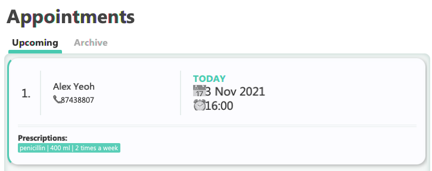

In the `AppointmentCard` part, appointments occurring today have a highlighted '**TODAY**' indicator to help clinic staff
easily identify appointments occurring today. Non-essential patient details are also omitted.

We can also toggle between the **Archive** and **Upcoming** tabs to view Appointments that are upcoming or have been
archived. This is also the reason why `MainWindow` component holds two `AppointmentListPanel`'s - One for
upcoming appointments, and the other for archived appointments.

A multi-panel display is used because the user should be able to look for an Appointment's patient details without
swapping back and forth between the Patient list and Appointments list. The tab display is used as archived appointments are likely
to be referred to less than upcoming ones. The decision to separate the two into two tabs reduces visual clutter significantly
and allows the user to view the more important information immediately.

### Logic component

**API** : [`Logic.java`](https://github.com/AY2122S1-CS2103-W14-1/tp/tree/master/src/main/java/seedu/docit/logic/Logic.java)

Here's a (partial) class diagram of the `Logic` component:


How the `Logic` component works:

1. When `Logic` is called upon to execute a command, it uses the `AddressBookParser` class to parse the user command.
    - `AddressBookParser` categorises the command according to its format (using RegEx) and hands it off
      to either one of `BasicAddressBookParser`, `PatientBookParser`, or `AppointmentBookParser`.
2. The chosen parser then parses the command and returns a `Command` object (more precisely, an object of one of its subclasses e.g., `AddPatientCommand`) which is executed by the `LogicManager`.
3. The command can communicate with the `Model` when it is executed (e.g. to add a patient).
4. The result of the command execution is encapsulated as a `CommandResult` object which is returned back from `Logic`.

The Sequence Diagram below illustrates the interactions within the `Logic` component for the `execute("pt delete 1")` API call.


<div markdown="span" class="alert alert-info">:information_source: **Note:** The lifeline for `DeletePatientCommandParser` should end at the destroy marker (X) but due to a limitation of PlantUML, the lifeline reaches the end of diagram.
</div>

Here are the other classes in `Logic` (omitted from the class diagram above) that are used for parsing a user command:

[comment]:


How the parsing works:

* When called upon to parse a user command, the `AddressBookParser` class creates an `XYZCommandParser` (`XYZ` is a placeholder for the specific command name e.g., `AddPatientCommandParser`) which uses the other classes shown above to parse the user command and create a `XYZCommand` object (e.g., `AddPatientCommand`) which the `AddressBookParser` returns back as a `Command` object.
* All `XYZCommandParser` classes (e.g., `AddPatientCommandParser`, `DeletePatientCommandParser`, ...) inherit from one of the three parser interfaces: `BasicParser`, `PatientParser`, or `AppointmentParser` so that they
  be treated appropriately based on the type of command issued.

* The three types of parsers (`BasicParser`, `PatientParser`, `AppointmentParser`) inherit directly from the `Parser` interface so that they can be treated similarly where possible e.g, during testing.

**Breakdown of Commands** <br>
In the original AB3, all commands extend the `Command` abstract class.
`Doc'it` supports three types of commands – general, patient-related, and appointment-related. As such, we introduce three abstract classes `BasicCommand`, `PatientCommand`, and `AppointmentCommand` in place of `Command`.

> As the names suggest, `BasicCommand` deals with whole application-related operations, `PatientCommand` deals with patient-related CRUD operations, and `AppointmentCommand` deal with appointment-related CRUD operations.

The following is a list of commands that extend the three abstract classes:

- `BasicCommand`
    - `ExitCommand`
    - `ClearCommand`
    - `HelpCommand`
- `PatientCommand`
    - `AddPatientCommand`
    - `EditPatientCommand`
    - `DeletePatientCommand`
    - `ListPatientCommand`
    - `FindPatientCommand`
    - `AddMedicalEntryCommandParser`
    - `DeleteMedicalEntryCommandParser`
- `AppointmentCommand`
    - `AddAppointmentCommand`
    - `ArchiveAppointmentCommand`
    - `EditAppointmentCommand`
    - `DeleteAppointmentCommand`
    - `ListAppointmentsCommand`
    - `SortAppointmentsCommand`
    - `AddPrescriptionCommand`
    - `DeletePrescriptionCommand`

> This taxonomy of commands is further reflected on the Parser's side as well.

**Parser** <br>
The `Parser` interface is broken into three sub-interfaces: `BasicParser`, `PatientParser`, and `AppointmentParser`, for the parsers related to application-related commands, patient-related commands, and
appointment-related commands respectively. For all commands under `PatientParser` and `AppointmentParser` (ones that require
any form of extra user input), we have a specific parser that tokenises the command:

- `PatientCommandParser`
    - `AddPatientCommandParser`
    - `EditPatientCommandParser`
    - `DeletePatientCommandParser`
    - `FindPatientCommandParser`
    - `AddMedicalEntryCommandParser`
    - `DeleteMedicalEntryCommandParser`
- `AppointmentParser`
    - `AddAppointmentCommandParser`
    - `EditAppointmentCommandParser`
    - `DeleteAppointmentCommandParser`
    - `AddPrescriptionCommandParser`
    - `DeletePrescriptionCommandParser`

### Model component
**API** : [`Model.java`](https://github.com/AY2122S1-CS2103-W14-1/tp/tree/master/src/main/java/seedu/docit/model/Model.java)


The `Model` component,

* stores the address book data and appointment book data (both upcoming and archived) i.e., all `Patient`, `Appointment` objects (which are contained in `UniquePatientList` and `UniqueAppointmentList` objects).
* stores the currently 'selected' `Patient` objects (e.g., results of a search query) as a separate _filtered_ list which is exposed to outsiders as an unmodifiable `ObservableList<Patient>` that can be 'observed' e.g. the UI can be bound to this list so that the UI automatically updates when the data in the list change.
* stores a `UserPref` object that represents the user’s preferences. This is exposed to the outside as a `ReadOnlyUserPref` objects.
* does not depend on any of the other three components (as the `Model` represents data entities of the domain, they should make sense on their own without depending on other components)

<div markdown="span" class="alert alert-info">:information_source: **Note:** An alternative (arguably, a more OOP) model is given below.


</div>

### Storage component

**API** : [`Storage.java`](https://github.com/AY2122S1-CS2103-W14-1/tp/tree/master/src/main/java/seedu/docit/storage/Storage.java)


The `Storage` component,

* can save address book data, appointment book data, and user preference data in json format, and read them back into corresponding objects.
* inherits from `AddressBookStorage`, `AppointmentBookStorage` and `ArchivedAppointmentBookStorage` and `UserPrefStorage`, which means it can be treated as either one (if only the functionality of only one is needed).
* depends on some classes in the `Model` component (because the `Storage` component's job is to save/retrieve objects that belong to the `Model`)

### Common classes

Classes used by multiple components are in the `seedu.addressbook.commons` package.

---

## **Implementation**

This section describes some noteworthy details on how certain features are implemented.

### Recording a Patient's Prescription feature

During appointments, the doctor can provide prescription of drugs for patients.
Recording this information together with appointment information helps clinic staff to keep track of prescriptions given to a patient.
Past prescriptions can also be viewed with past appointments.

#### How Prescription is implemented

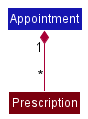

The implementation of the Prescription class is done with a ```Prescription``` class. The ```Prescription``` class keep records of the medicine given, volume of medicine, and the duration which the medicine is taken.
```Prescription``` objects are composed under ```Appointment``` objects, and will be deleted along with the parent ```Appointment``` object.
Within each ```Appointment``` class, a collection of these ```Prescription``` objects are stored.

The following commands are available from the ```Appointment``` class to interact with ```Prescription``` objects.

* ```addPrescription(Prescription prescription)```- adds a new prescription for that appointment.
* ```removePrescription(String medicineName)```- removes an existing prescription based on the name of the medicine.
* ```listPrescriptions()```- lists all prescriptions for that appointment.

#### Reason for implementation of Prescription

```Prescription``` and ```Appointment``` forms a whole-part relationship and hence ```Prescription``` is suitable to be stored as a field of ```Appointment```.
```Prescription``` will also be deleted when appointment is deleted due to this whole-part relationship.  As an ```Appointment``` can have multiple ```Prescription```, the multiplicity is many to one.

#### Alternatives considered

1. Storing ```Prescription``` in a ```UniquePrescriptionList``` object.

This method was considered at first to improve separation of concerns. However, the increased complexity of adapting storage to work with nested composite data structures was deemed to be too high and infeasible.

### Medical History

**Class Implementation details**

- The `MedicalHistory` class composes an `EntryList<Entry<MedicalEntry>>` class.
- The `EntryList` class references the `Entry<MedicalEntry>` through an `ArrayList`.
- The `Entry<MedicalEntry>` class is an abstract class that is either a `Some<MedicalEntry>` or an `Empty<Object>` class. 
- Each `Patient` class composes exactly one `MedicalHistory` class.
- `MedicalEntry` is an inner static class of `MedicalHistory`
- Each `MedicalEntry` has a `description` data attribute and a `dateOfRecord` data attribute. The `description` data is supplied by the user. The `dateOfRecord` is automatically generated based on the date the medical entry was recorded.

Below is a class diagram illustrating the relationship between `Patient` and `MedicalHistory`. Note: other details within the `Model` component are omitted.

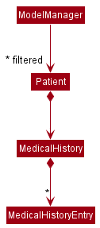


**Design Considerations**

| Alternative Considered | Current implementation | Rationale for current implementation |
| ---------- | ------------------------ | ------------------------ |
| Using a list of medical entries as an attribute of a `Patient` class | Multiple or zero `MedicalEntry` objects can be stored by a single `MedicalHistory`. Each `Patient` class has exactly one `MedicalHistory` reference.         | ```Patient``` and ```MedicalHistory``` share a whole-part relationship: when a ```Patient``` object is destroyed, the corresponding ```MedicalHistory``` object is also destroyed. If the `Patient` does not have any medical records, this means that the `MedicalHistory` is empty, which is reflected by a single `EMPTY_MEDICAL_HISTORY` (instantiation of a `MedicalHistory` object with an `EntryList<Entry<MedicalEntry>>` containing exactly one `Entry` that is an `Empty`). Hence, there is a 1...1 multiplicity relationship between ```Patient``` and ```MedicalHistory```, as one patient can have exactly one medical history. Following OOP Principles, it is more apt to encapsulate medical history records (or medical entries) as a `MedicalHistory` class than using a collection of medical entries, e.g. `List<MedicalEntry>`. |
| Using `null` to reflect an empty `MedicalHistory` for patients that do not have any recorded medical history | An empty `MedicalHistory` object is instantiated (`EMPTY_MEDICAL_HISTORY`), and this object is referenced in every `Patient` object that does not have any medical history records.       | It is not a mistake for a patient to have zero medical history records. If we were to use `null` to reflect an empty medical history, there would be many scenarios where by running a blanket command on a patient, `NullPointerException` would be thrown at runtime if we do not check for `null`. Hence, as part of our defensive programming efforts, we created a single `EMPTY_MEDICAL_HISTORY` object that is an instantiation of a `MedicalHistory` object with an `EntryList<Entry<MedicalEntry>>` containing exactly one `Entry` that is an `Empty`. This allows us to bypass `NullPointerException` due to the additional null safety built in and exploit polymorphism.|
| Using the `Optional` interface to reflect an `Entry` | `Entry` class is implemented to reflect an `Entry` that is either `Some` or `Empty`, such that all `null` or `empty` inputs into the factory `of` method generate an `Entry.Empty`, and every other input generates an `Entry.Some`     | When the `Optional::of` takes in `null`, a runtime exception is thrown. But `null` is a valid input. While `Optional` provides an `ofNullable` method, we wanted to take an active defensive programming approach. We thus constructed the `Entry` class, whereby there is only one factory `of` method, where `null` inputs are taken care of. |
| Using the `List` interface to reflect a list of entries | `EntryList` class is implemented to reflect an `EntryList` that contains the `Entry` | We want to limit the methods available for an `EntryList` to only `add`, `delete`, `size`, `get`, `toStream`. Each `Entry` and their position within the `EntryList` should not be modifiable. After all, at our current stage of production, we do not want the `MedicalEntry` to have a different order from their time of input. Iterator functions of the `List` interface allow for modification of contents of an `Entry` at a specified position in the `List`, which violates this invariant. As part of defensive programming, we thus chose to create an `EntryList` class that exposes only the immutable functions of a `List`.|
| Having `MedicalEntry` as a separate class from `MedicalHistory` | `MedicalEntry` is an inner static class of `MedicalHistory`     | A `MedicalEntry` can only exist if there is a `MedicalHistory`. There should be no instantiation of a `MedicalEntry` without a `MedicalHistory` instantiated. We also do not want `MedicalEntry` to implement any interface that `MedicalHistory` does not. Thus, we opted to have `MedicalEntry` as an inner class of `MedicalHistory`. |

#### Add Medical Entry feature

**Overview**

The Add Medical Entry feature allows users to add medical entries into the `MedicalHistory` of a `Patient`. Each new `MedicalEntry` must have the data field `description`, which is the description of the medical record (e.g. `diabetes`).

Below is a class diagram of the components involved in the Add Medical Entry feature.


**Implementation details of feature**

The Add Medical Entry feature is implemented via the `AddMedicalEntryCommand`, which is supported by the `AddMedicalEntryCommandParser`. The `AddMedicalEntryCommandParser` implements the `PatientParser` interface.  
1. `LogicManager` receives the user input which is parsed by the `AddressBookParser`.
2. The `AddressBookParser` invokes the `PatientBookParser` based on the regex pattern of the user input, splitting the user input into `commandWord` and `arguments`.
3. The `PatientBookParser` invokes the `AddMedicalEntryCommandParser` based on the `commandWord`, calling the method `parsePatientCommand` with `arguments` as the method argument. 
4. `AddMedicalEntryCommandParser` takes in the argument string and invokes an `ArgumentMultiMap`, which tokenizes the `arguments`.
5. If the required `preamble` and `PREFIX_MEDICAL` is present, the `AddMedicalEntryCommandParser` will invoke the `AddMedicalEntryCommand` after calling the `parseMedicalHistory` method provided by `ParserUtil`, which returns a `MedicalHistory` based on the `description` data field. The `preamble` identifies the `Index` of the `Patient` to add the medical entry to, while the string after `PREFIX_MEDICAL` specifies the `description` data field required for adding a new `MedicalEntry`.
6. `LogicManager` calls the `execute` method of the `AddMedicalEntryCommand`, which calls the `addMedicalHistory` of the `Patient` specified by the `Index`.
7. The `AddMedicalEntryCommand` will then call the methods `setPatient`, `updateAppointmentBook`, `updateFilteredPatientList` and `updateFilteredAppointmentList` provided by the `Model`, editing the patient's medical history information.
8. The `AddMedicalEntryCommand` returns a `CommandResult`, which will be returned to the `LogicManager`. 

Below is a sequence diagram illustrating the interactions between the `Logic` and `Model` components when the user inputs `pt ma 1 m/diabetes` command. Note that the full command string has been abbreviated to `...`.

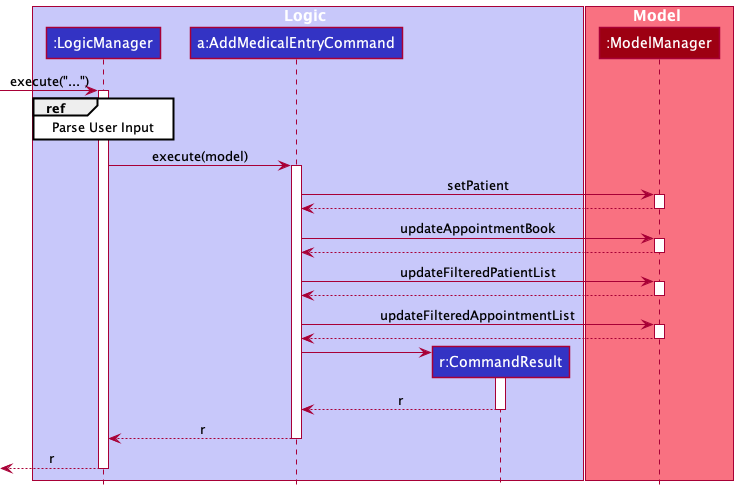

The following activity diagram summarises what happens within `AddMedicalEntryCommandParser` when the user executes an Add Medical Entry command.

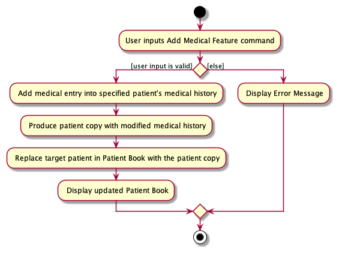

**Design considerations**

| Alternative Considered | Current implementation | Rationale for current implementation |
| ---------- | ------------------------ | ------------------------ |
| Implementing a `MedicalHistoryBookParser` to invoke the `AddMedicalEntryCommandParser` | Having `PatientBookParser` invoke `AddMedicalEntryCommandParser`  | Since `MedicalHistory` is an attribute of `Patient`, it makes sense to use the `PatientBookParser`. It also takes more effort to implement a new `Parser` that requires an entirely new command word prefix to add a `MedicalEntry`. |


#### Delete Medical Entry feature

**Overview**

The Delete Medical Entry feature allows users to delete medical entries from the `MedicalHistory` of a `Patient`.

Below is a class diagram of the components involved in the Delete Medical Entry feature.

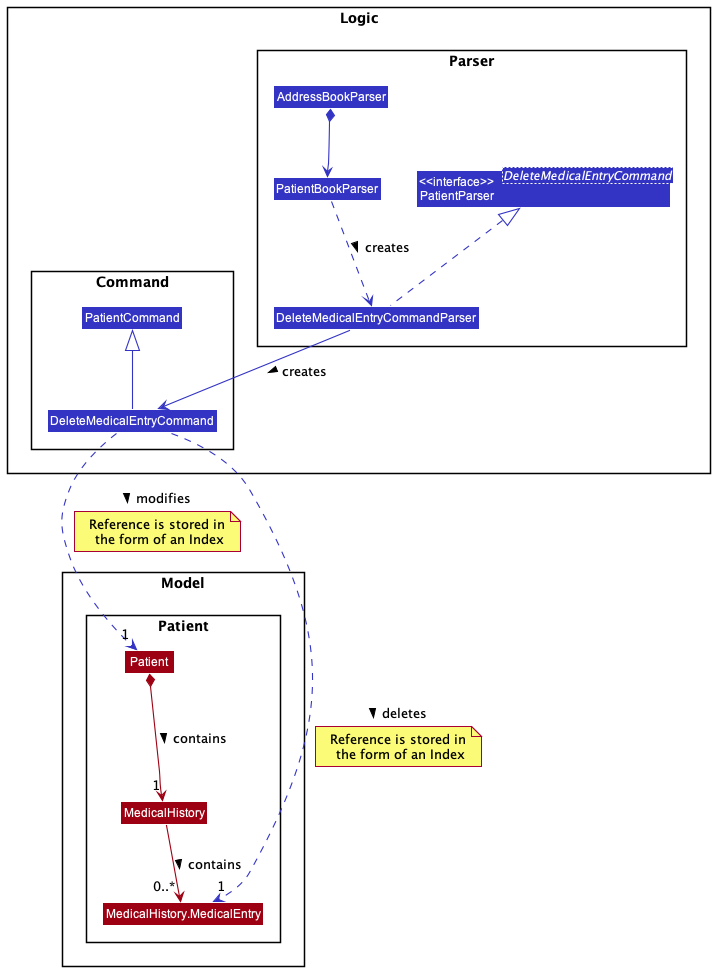

**Implementation details of feature**

The Delete Medical Entry feature is implemented via the `DeleteMedicalEntryCommand`, which is supported by the `DeleteMedicalEntryCommandParser`. The `DeleteMedicalEntryCommandParser` implements the `PatientParser` interface.
1. `LogicManager` receives the user input which is parsed by the `AddressBookParser`.
2. The `AddressBookParser` invokes the `PatientBookParser` based on the regex pattern of the user input, splitting the user input into `commandWord` and `arguments`.
3. The `PatientBookParser` invokes the `DeleteMedicalEntryCommandParser` based on the `commandWord`, calling the method `parsePatientCommand` with `arguments` as the method argument.
4. `DeleteMedicalEntryCommandParser` takes in the argument string and invokes an `ArgumentMultiMap`, which tokenizes the `arguments`.
5. If the required `patientIndex` and `medicalIndex` is present, the `DeleteMedicalEntryCommandParser` will invoke the `DeleteMedicalEntryCommand` after calling the `parseIndex` method provided by `ParserUtil`, which returns an `Index` to specify the `patient` and the `medicalEntry` to be deleted. 
6. `LogicManager` calls the `execute` method of the `DeleteMedicalEntryCommand`, which calls the `deleteMedicalHistory` of the `Patient` specified by the `Index`.
7. The `DeleteMedicalEntryCommand` will then call the methods `setPatient`, `updateAppointmentBook`, `updateFilteredPatientList` and `updateFilteredAppointmentList` provided by the `Model`, editing the patient's medical history information.
8. The `DeleteMedicalEntryCommand` returns a `CommandResult`, which will be returned to the `LogicManager`.

Below is a sequence diagram illustrating the interactions between the `Logic` and `Model` components when the user inputs `pt md 1 i/1` command. Note that the full command string has been abbreviated to `...`.

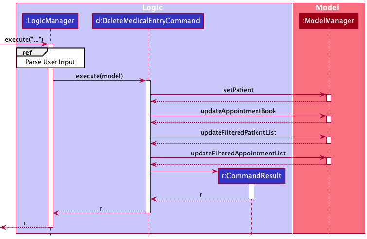

The following activity diagram summarises what happens within `DeleteMedicalEntryCommandParser` when the user executes a DeleteMedicalEntry command.

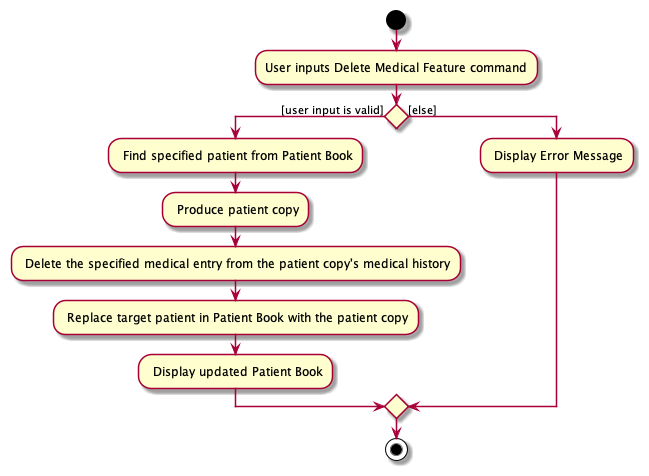

**Design Considerations**

| Alternative Considered | Current implementation | Rationale for current implementation |
| ---------- | ------------------------ | ------------------------ |
| Implementing a `MedicalHistoryBookParser` to invoke the `DeleteMedicalEntryCommandParser` | Having `PatientBookParser` invoke `DeleteMedicalEntryCommandParser`  | Since `MedicalHistory` is an attribute of `Patient`, it makes sense to use the `PatientBookParser`. It also takes more effort to implement a new `Parser` that requires an entirely new command word prefix to delete a `MedicalEntry`. |


### Appointment composed of a Valid Patient when added, loaded and stored

#### How Appointment is implemented

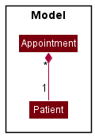

Each `Appointment` in memory contain
s a reference to a valid `Patient` object. To ensure this valid reference is maintained while the app is running and between different running instances, modifications were made to how `Appointment` is added, loaded and stored.

Major changes involved to implement this feature:

* Adding a new appointment  —  `AddAppointmentCommand#execute()` gets patient at the given index in the address book to create a new appointment referencing that patient.
* Loading an appointment on app launch  —
    * The app first loads address book, then passes the address book as argument to `Storage#readAppointmentBook()`.
    * `Storage#readAppointmentBook()` gets the corresponding patient from the patient index in `JSONAdaptedAppointments` and instantiates appointments.
* Storing an appointment after every command  —
    * The app runs `LogicManager#saveAppointmentBook()`.
    * `LogicManager#saveAppointmentBook()` gets the index of the patient referenced by the appointment, that is to be stored as `JSONAdaptedAppointments` in JSON file.

Given below is an example usage scenario and how the Appointment composed of a Valid Patient feature behaves at each step.


#### Loading Appointments

Step 1: The user launches the application. `MainApp` runs `MainApp#initModelManager` to initialize the model. First, the address book of patients is loaded to memory in `StorageManager#readAddressBook()`. Referencing the order of patients in this loaded address book, `StorageManager#readAppointmentBook()` loads the appointment book. Under `Storage`, the JSON file is loaded to `JsonAdaptedAppointment` object and its `JsonAdaptedAppointment#toModelType()` is executed. `JsonAdaptedAppointment#toModelType()` runs `AddressBook#getPatientOfIndex()` to get the patient of the appointment at the index loaded from the JSON file. The Appointment object is then instantiated.


#### Adding Appointments

Step 2: The user executes `apmt add i/1 d/2021-10-19 1800` to add an appointment to the first patient of the address book. The `apmt add` command calls `Model#getFilteredPatientList()`to receive a list of patients and gets the Patient object at the inputted index. A new Appointment of that patient is instantiated, and the `AddAppointmentCommand` calls `Model#addAppointment()` to add this appointment to the appointment book. A `CommandResult` is instantiated and returned.


#### Deleting Patient that has made an Appointment

Step 3: The user executes `pt delete 1` to delete the first patient in the address book. The patient is deleted and the corresponding appointments and archive appointments with that patient are deleted. The `pt delete` command calls `AddressBook#deleteAppointmentsWithPatient()` to delete all appointments to that patient before deleting the patient.

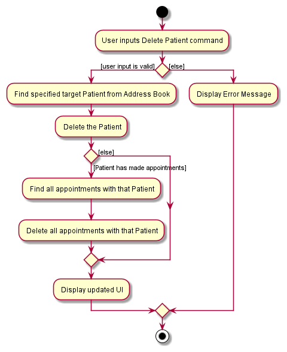

#### Saving Appointments

After every command that the user makes, appointments are saved. In `LogicManager#executes`, after every command is executed, `LogicManager` calls `StorageManager#saveAppointmentBook`, passing in the appointment book and address book from `Model` as arguments. In converting model-type Appointments to `JSONAdaptedAppointment`, `AddressBook#getIndexOfPatient()` is called to get the corresponding index of the patient for storage.

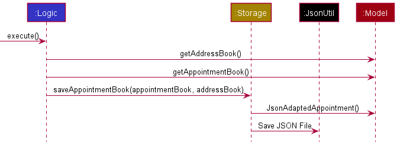

The diagram below is a more in-depth look at how `JSONAdaptedAppointment` is instantiated.

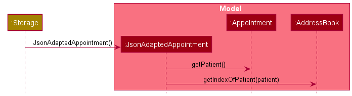

#### Design considerations

**Aspect: How Appointments are instantiated**

* **Alternative 1 (current choice):** Appointment is composed of a Patient.
    * **Justification:** Appointment can only be instantiated with a Patient, and without Patients,
      Appointments cannot exist.
      Hence, for an appointment to be instantiated, it requires a reference to the related Patient object.
    * **Pros:** Enforces 1 multiplicity requiring one Appointment to be associated with exactly one Patient.
    * **Pros:** Easy to find the patient of the appointment.
    * **Cons:** Need to locate corresponding Patient before Appointment can be instantiated. Thus, `AddressBook`
      must be loaded to memory before `AppointmentBook`.
* **Alternative 2:** Patient and Appointment have an association such that Patient has a link to Appointment and
  Appointment only requires date and time to instantiate.
    * **Pros:** Able to load `AppointmentBook` without loaded `AddressBook`.
    * **Cons:** Appointments may not be unique objects as there may be patients with multiple appointments at the same
      date and time at the same clinic that can be served by different doctors.
    * **Cons:** Difficult to find Patient of each Appointment when Appointment is extracted from Patients and listed
      because Appointment has no Patient field.

**Aspect: How Appointments are stored and loaded**

* **Alternative 1 (current choice):** Save `Appointment` as the index of corresponding patient in `AddressBook` and
  datetime.
    * **Justification:** The order of `AddressBook` does not change when saving or loading `AppointmentBook`. The order
      of `AddressBook` is saved each time `AppointmentBook` is saved.
    * **Pros:** Index of patient requires less code then implementing a unique ID and fits with our theme of using
      indices in commands.
    * **Pros:** Index of patient is guaranteed to be a unique identifier.
    * **Cons:** Order of the `AddressBook` is important. If the order of patients is changed in the json file, the
      appointments will become incorrect.
* **Alternative 2:** Implement a hash or Universally Unique Identifier (UUID) to for each Patient and Appointment
  object. Save `Appointment` with Patient UUID and save `Patient` with Appointment UUID.
    * **Pros:**  Changing the order of appointments and patients in saved JSON file will not change affect loading of
      data.
    * **Cons:** Requires more code to implement a unique hash or UUID and find the corresponding Patient and
      Appointment by traversing the `AddressBook` and `AppointmentBook` respectively.
    * **Cons:** Takes more computational work when loading compared to finding the `Patient` at an index at O(1) time.

### Archiving an Appointment

**Overview**

A user is able to archive an appointment when the appointment is _expired_, i.e. the patient has either missed his/her appointment
or already attended the scheduled appointment. In this case, the appointment should be archived, so that clinic staff
are able to view what medicine was prescribed to the patient during previous appointments.

**Implementation Details**

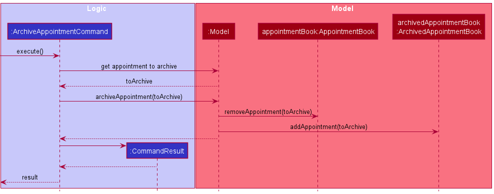


Users may archive specific appointments manually to remove visual clutter. This is done through the `ArchiveAppointmentCommand`.

The above sequence diagram displays how the archive command works. The parsing mechanism has been abstracted out from the above diagram as it
has been covered in previous diagrams. An example input can be viewed in our [User guide](UserGuide.md). It first retrieves the Appointment to archive from the
appointment index parsed through the user input, removes the appointment from upcoming appointments, and adds it to archived appointments.

Archiving is facilitated by the `ArchivedAppointmentBook`. As opposed to the regular `AppointmentBook`, it does not allow
users to directly modify the data of appointments as archived data should not be edited. Hence, the following operations
have the `private` access modifier:

- `ArchivedAppointmentBook#setAppointment(Appointment target, Appointment editedAppointment)` - edits the `target` Appointment
  to be replaced with `editedAppointment`.
- `ArchivedAppointmentBook#removeAppointment(Appointment key)` - removes the target Appointment `key`.

The reason these methods exist in the class is so to support the methods `ArchivedAppointmentBook#updatePatient(Patient target, Patient editedPatient)`
and `ArchivedAppointmentBook#removePatient(Patient target)`, which are called to accurately reflect any updates/removals of patient
details.

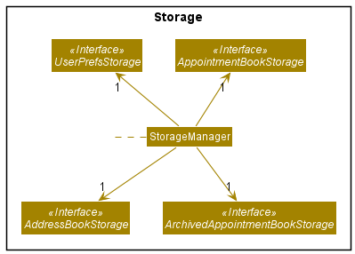

In the `Storage` component, the addition of `ArchivedAppointmentBook` also necessitates the implementation of a separate storage system
for archived appointments. This forms under `ArchivedAppointmentBookStorage`, alongside `AddressBookStorage` and `AppointmentBookStorage`.
The .json file for archived appointments is named 'archivedappointmentbook.json'.

**Design Considerations**

| Alternative Considered | Current implementation | Rationale for current implementation |
| ---------- | ------------------------ | ------------------------ |
| Implementing archived appointments as a second `UniqueAppointmentList` attribute under the `AppointmentBook` class | Have a separate class `ArchivedAppointmentBook` | Having a separate class `ArchivedAppointmentBook` separates the two types of appointments better to facilitate data management. It ties in better with our Storage framework, and archivedappointmentbook.json files can be easily used by the user, instead of having to split one appointmentbook.json files into two segments. |


#### Auto-Archiving Feature

The archiving implementation involves scanning through all appointments in a day and comparing it to
the current date and time of the user system. If the current date and time is 24 hours ahead of the scheduled
appointment time (24-hour buffer), i.e. by our definition, _expired_, the appointment is automatically archived. This auto-archiving implementation is handled
by the `ModelManager` class in two ways.

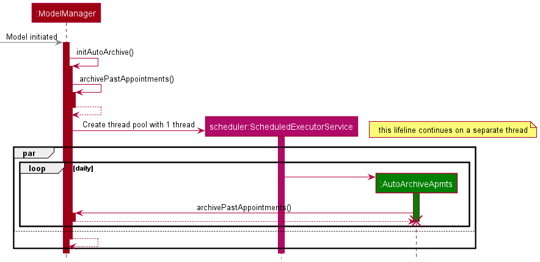

1. Upon initialisation of the application, the application automatically archives expired appointments (24-hours past their
   scheduled time). This is called through `ModelManager#archivePastAppointments()`.


2. A `ScheduledExecutorService` object schedules the task `AutoArchiveApmts` which implements the `Runnable` interface.
   Every day at the `ModelManager.UPDATE_HOUR`th hour, the `Runnable` object executes the `ModelManager#archivePastAppointments()`
   method.


In the case where there are many scheduled appointments, this saves the user trouble of archiving past appointments when
they are already over.


---

## **Documentation, logging, testing, configuration, dev-ops**

* [Documentation guide](Documentation.md)
* [Testing guide](Testing.md)
* [Logging guide](Logging.md)
* [Configuration guide](Configuration.md)
* [DevOps guide](DevOps.md)

---

## **Appendix: Requirements**

### Product scope

**Target user profile**:

* Authorised staff from small family clinics (both receptionist and doctors)
* Clinics lacking access to the cloud and are undeveloped compared to hospitals
* Young clinics that do not have technological capabilities

**Value proposition**:
Today, small family clinics often record patient information using paper application forms.
Such recording of patient information results in the clinic having a messy and inefficient patient record information;
the family clinic will have to flip through files and documents in order to find the patient. Doc’it aims to provide a
centralised platform for authorised staff from small family clinics to view, update and onboard patients.
With Doc’it, small family clinics are able to reduce man hours from managing paper documents,
and translate these ‘saved’ hours into providing better frontline service to patients, focusing on what they do best.

### User stories

Priorities: High (must have) - `* * *`, Medium (nice to have) - `* *`, Low (unlikely to have) - `*`


| Priority | As a …                | I want to …                                                                             | So that I can…                                                               |
| ---------- | ------------------------ | ------------------------------------------------------------------------------------------ | ------------------------------------------------------------------------------- |
| `* * *`  | clinic staff           | create new patient details                                                               | add data of new patients in our clinic                                        |
| `* * *`  | clinic staff           | add medical history to patient details                                                   | have a background on the patient                                              |
| `* * *`  | clinic staff           | view patient details                                                                     | better prescribe medication and treatments to my out-patients                 |
| `* * *`  | clinic staff           | delete patient details                                                                   | manage patients’ need for privacy when patients no longer visit the clinic   |
| `* * *`  | clinic staff           | view the prescriptions currently prescribed to my patients                               | provide correct prescriptions to them                                         |
| `* * *`  | clinic staff           | create new appointments from patients                                                    | track upcoming appointments                                                   |
| `* * *`  | clinic staff           | view appointments from patients                                                          | know at-a-glance what are the upcoming appointments and the patients involved |
| `* * *`  | clinic staff           | delete appointments from patients                                                        | re-organise appointments when either side cancels their appointments          |
| `* * *`  | clinic staff           | have appointments moved to appointment history                                           | separate what are the upcoming appointments from past appointments            |
| `* * *`  | clinic staff           | view past appointments                                                                   | track their medical history                                                   |
| `* *`    | clinic staff           | edit appointments from patients                                                          | ensure appointment records are up-to-date                                     |
| `* *`    | clinic staff           | modify patient details                                                                   | ensure that any changes in their information are up-to-date                   |
| `* *`    | clinic staff           | edit prescriptions                                                                       | ensure my patients’ current prescriptions are up-to-date                     |
| `* *`    | clinic staff           | view the duration of prescriptions                                                       | decide whether they should be given additional prescriptions                  |
| `* *`    | clinic staff           | move prescriptions to prescription history when patients have finished that prescription |                                                                               |
| `* *`    | clinic staff           | view the prescription history of patients                                                | know what drugs my patients have taken before                                 |
| `* *`    | clinic staff           | cannot edit past prescriptions                                                           | prevent erroneous edits                                                       |
| `* *`    | clinic staff           | verify that the patient has paid for his appointment                                     | record that the patient has paid the bills                                    |
| `* *`    | clinic staff           | input the bill and price of the patient appointment                                      | record the amount that the patient has paid                                   |
| `* *`    | clinic staff           | prevent editing past appointments                                                        | ensure past records cannot be incorrectly modified                            |
| `* *`    | clinic staff           | filter patients by name                                                                  | pull up patient records easily when requested                                 |
| `* *`    | clinic staff           | filter patients by the date of their appointment                                         | know the list of patients per appointment day                                 |
| `* *`    | clinic staff           | filter patients by their prescriptions                                                   | gauge the demand of prescription_drug needed by the clinic                    |
| `* *`    | new clinic staff       | go through a tutorial at the beginning                                                   | familiarise myself with how the app works and what it can do                  |
| `* *`    | new clinic staff       | type a command to get all available commands and how they work                           | easily refer to the commands I can make                                       |
| `* *`    | clinic staff           | purge all current data                                                                   | delete any experimental records                                               |
| `* *`    | long term clinic staff | use shortened command aliases                                                            | speed up my work                                                              |
| `* *`    | clinic staff           | easily make changes to the patient records without too many commands                     | my work can be done faster                                                    |
| `* *`    | clinic staff           | view information on an appealing GUI                                                     | view information that is neatly organised                                     |
| `* *`    | clinic staff           | share a single patient database with other clinic staff                                  | ensure all changes are synced                                                 |

*{More to be added}*

### Use cases

(For all use cases below, the **System** is the ``Doc'it`` and the **Actor** is the `user`, unless specified otherwise)

**Use case: UC01 - List all patients**

**MSS**

1. User requests to list patients.
2. `Doc'it` displays all patients.

   Use case ends.

**Extensions**

* 1a. The list is empty.

  Use case ends.

**Use case: UC02 - Add a patient**

**MSS**

1. User requests to add a patient.
2. `Doc'it` adds the patient with necessary information.

   Use case ends.

**Extensions**

* 1a. Necessary details of patient are absent (name, NRIC).

    * 1a1. `Doc'it` shows an error message.

  Use case resumes at step 1.
* 1b. Patient details conflict with existing patient list.

    * 1b1. `Doc'it` shows an error message.

  Use case resumes at step 1.

**Use case: UC03 - Delete a patient**

**MSS**

1. User requests to list patients.
2. `Doc'it` shows a list of patients.
3. User requests to delete a specific patient in the list.
4. `Doc'it` deletes the patient.

   Use case ends.

**Extensions**

* 2a. The list is empty.

  Use case ends.
* 3a. The given index is invalid.

    * 3a1. `Doc'it` shows an error message.

      Use case resumes at step 2.

**Use case: UC04 - View the records of a patient**

**MSS**

1. User requests to view a patient record.
2. `Doc'it` shows the details of the patient.

   Use case ends.

**Extensions**

* 1a. The specified patient does not exist.

    * 1a1. `Doc'it` shows an error message.

      Use case resumes at step 1.

**Use case: UC05 - List all appointments**

**MSS**

1. User requests to list appointments.
2. `Doc'it` displays all appointments.

   Use case ends.

**Extensions**

* 1a. The list is empty.

  Use case ends.

**Use case: UC06 - Add an appointment**

**MSS**

1. User requests to list patients.
2. `Doc'it` displays all patients.
3. User adds an appointment, matching the appointment to the specific patient.
4. `Doc'it` adds the appointment and associates it to the patient.

   Use case ends.

**Extensions**

* 3a. The date of the appointment AND/OR the specified patient are invalid.

    * 3a1. `Doc'it` shows an error message.

      Use case resumes at step 3.

**Use case: UC07 - Delete an appointment**

**MSS**

1. User requests to list appointments.
2. `Doc'it` displays all appointments.
3. User requests to delete a specific appointment in the list.
4. `Doc'it` deletes the appointment and removes the appointment association from the originally associated patient.

   Use case ends.

**Extensions**

* 2a. The list is empty.

  Use case ends.
* 3a. The given index is invalid.

    * 3a1. `Doc'it` shows an error message.

      Use case resumes at step 2.

**Use case: UC08 - Archive an appointment**

**MSS**

1. User requests to list appointments.
2. `Doc'it` displays all appointments.
3. User requests to archive all appointments that are past its date.
4. `Doc'it` archives all appointments that are past its date.

   Use case ends.

**Extensions**

* 2a. The list is empty.

  Use case ends.
* 3a. No appointments are past its date.

  Use case ends.

**Use case: UC08 - Exit program**

**MSS**

1. User requests to exit the program.
2. `Doc'it` saves and writes all files.
3. `Doc'it` exits and closes.

   Use case ends.

**Extensions**

* 2a. `Doc'it` is unable to save file.

    * 2a1. `Doc'it` shows an error message.

      Use case resumes at step 1.

### Non-Functional Requirements

1. Should work on any _mainstream OS_ as long as it has Java `11` or above installed.
2. Should be able to hold up to 1000 patients without noticeable sluggishness in performance for typical usage.
3. A user with above average typing speed for regular English text (i.e. not code, not system admin commands) should be able to accomplish most of the tasks faster using commands than using the mouse.
4. Should not require an external installer or launcher.
5. Data should be stored locally in an easily-editable text file.
6. Should not depend on any cloud-based remote server.
7. Data should not be stored in an external Database Management System (DBMS) or data warehouse.

### Glossary

* **Mainstream OS**: Windows, Linux, Unix, OS-X
* **Private contact detail**: A contact detail that is not meant to be shared with others

---

## **Appendix: Instructions for manual testing**

Given below are instructions to test the app manually.

<div markdown="span" class="alert alert-info">:information_source: **Note:** These instructions only provide a starting point for testers to work on;
testers are expected to do more *exploratory* testing.

</div>

### Launch and shutdown

1. Initial launch

    1. Download the jar file and copy into an empty folder
    2. Double-click the jar file Expected: Shows the GUI with a set of sample contacts. The window size may not be optimum.
2. Saving window preferences

    1. Resize the window to an optimum size. Move the window to a different location. Close the window.
    2. Re-launch the app by double-clicking the jar file.<br>
       Expected: The most recent window size and location is retained.
3. _{ more test cases … }_

### Deleting a patient

1. Deleting a patient while all patients are being shown

    1. Prerequisites: List all patients using the `list` command. Multiple patients in the list.
    2. Test case: `delete 1`<br>
       Expected: First contact is deleted from the list. Details of the deleted contact shown in the status message. Timestamp in the status bar is updated.
    3. Test case: `delete 0`<br>
       Expected: No patient is deleted. Error details shown in the status message. Status bar remains the same.
    4. Other incorrect delete commands to try: `delete`, `delete x`, `...` (where x is larger than the list size)<br>
       Expected: Similar to previous.
2. _{ more test cases … }_

### Saving data

1. Dealing with missing/corrupted data files

    1. _{explain how to simulate a missing/corrupted file, and the expected behavior}_
2. _{ more test cases … }_
