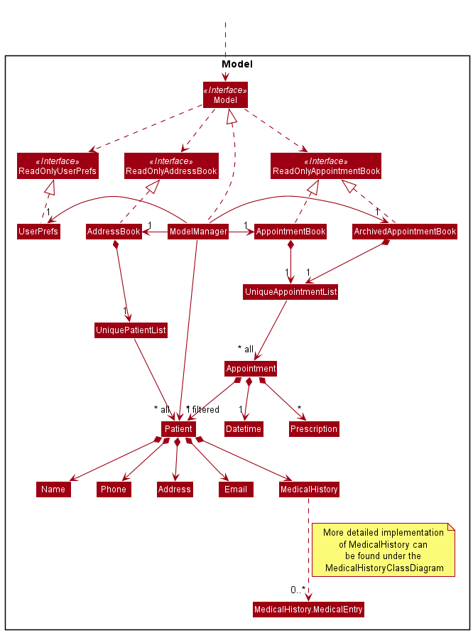
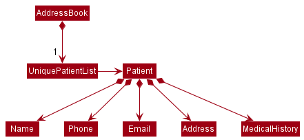
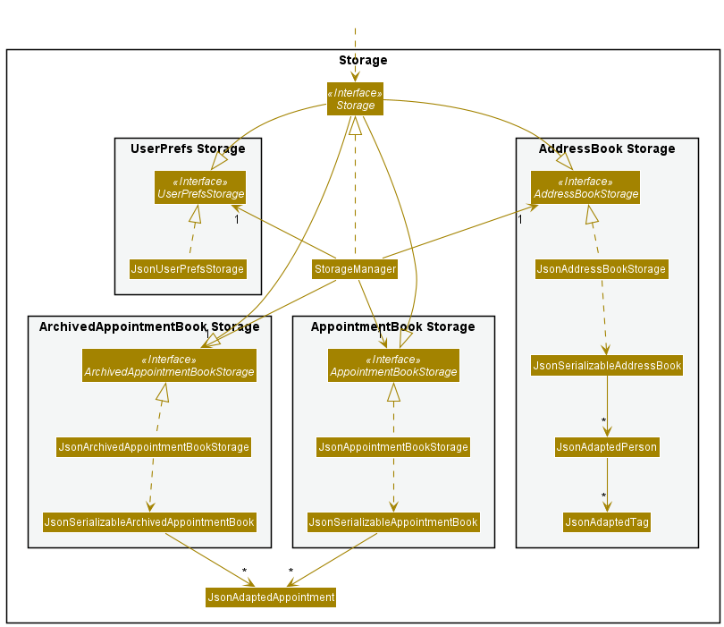
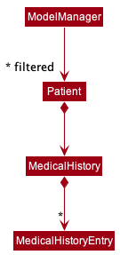
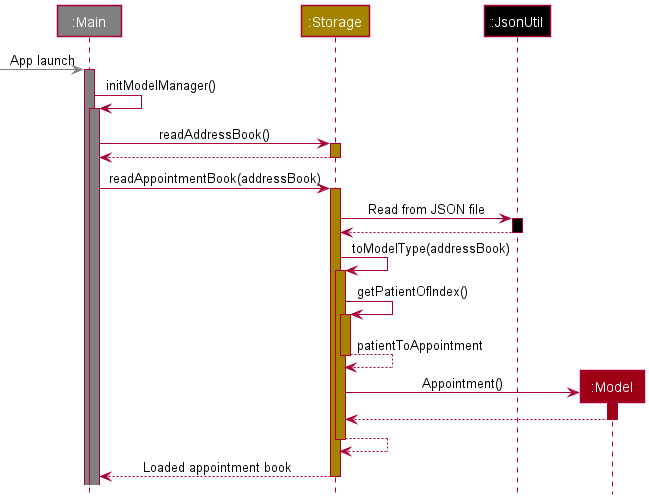
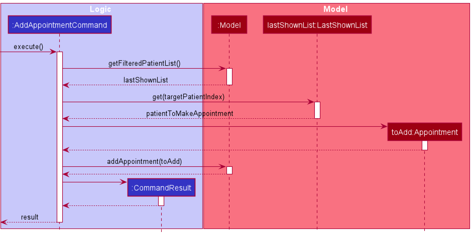
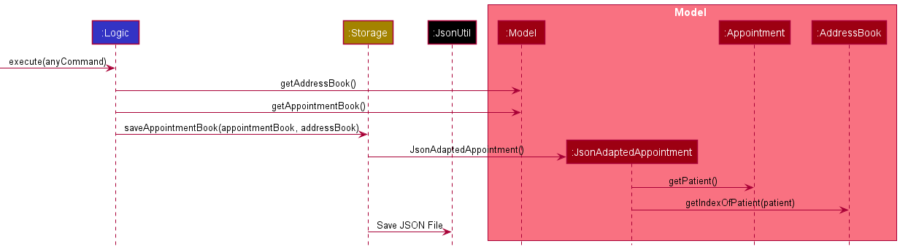

* Table of Contents
  {:toc}

--------------------------------------------------------------------------------------------------------------------

## **Acknowledgements**

* {list here sources of all reused/adapted ideas, code, documentation, and third-party libraries -- include links to the original source as well}

--------------------------------------------------------------------------------------------------------------------

## **Setting up, getting started**

Refer to the guide [_Setting up and getting started_](SettingUp.md).

--------------------------------------------------------------------------------------------------------------------

## **Design**

<div markdown="span" class="alert alert-primary">

:bulb: **Tip:** The `.puml` files used to create diagrams in this document can be found in the [diagrams](https://github.com/se-edu/addressbook-level3/tree/master/docs/diagrams/) folder. Refer to the [_PlantUML Tutorial_ at se-edu/guides](https://se-education.org/guides/tutorials/plantUml.html) to learn how to create and edit diagrams.
</div>

### Architecture


The ***Architecture Diagram*** given above explains the high-level design of the App.

Given below is a quick overview of main components and how they interact with each other.

**Main components of the architecture**

**`Main`** has two classes called [`Main`](https://github.com/se-edu/addressbook-level3/tree/master/src/main/java/seedu/address/Main.java) and [`MainApp`](https://github.com/se-edu/addressbook-level3/tree/master/src/main/java/seedu/address/MainApp.java). It is responsible for,
* At app launch: Initializes the components in the correct sequence, and connects them up with each other.
* At shut down: Shuts down the components and invokes cleanup methods where necessary.

[**`Commons`**](#common-classes) represents a collection of classes used by multiple other components.

The rest of the App consists of four components.

* [**`UI`**](#ui-component): The UI of the App.
* [**`Logic`**](#logic-component): The command executor.
* [**`Model`**](#model-component): Holds the data of the App in memory.
* [**`Storage`**](#storage-component): Reads data from, and writes data to, the hard disk.


**How the architecture components interact with each other**

The *Sequence Diagram* below shows how the components interact with each other for the scenario where the user issues the command `delete 1`.


Each of the four main components (also shown in the diagram above),

* defines its *API* in an `interface` with the same name as the Component.
* implements its functionality using a concrete `{Component Name}Manager` class (which follows the corresponding API `interface` mentioned in the previous point.

For example, the `Logic` component defines its API in the `Logic.java` interface and implements its functionality using the `LogicManager.java` class which follows the `Logic` interface. Other components interact with a given component through its interface rather than the concrete class (reason: to prevent outside component's being coupled to the implementation of a component), as illustrated in the (partial) class diagram below.


The sections below give more details of each component.

### UI component

The **API** of this component is specified in [`Ui.java`](https://github.com/se-edu/addressbook-level3/tree/master/src/main/java/seedu/address/ui/Ui.java)


The UI consists of a `MainWindow` that is made up of parts e.g.`CommandBox`, `ResultDisplay`, `PersonListPanel`, `StatusBarFooter` etc. All these, including the `MainWindow`, inherit from the abstract `UiPart` class which captures the commonalities between classes that represent parts of the visible GUI.

The `UI` component uses the JavaFx UI framework. The layout of these UI parts are defined in matching `.fxml` files that are in the `src/main/resources/view` folder. For example, the layout of the [`MainWindow`](https://github.com/se-edu/addressbook-level3/tree/master/src/main/java/seedu/address/ui/MainWindow.java) is specified in [`MainWindow.fxml`](https://github.com/se-edu/addressbook-level3/tree/master/src/main/resources/view/MainWindow.fxml)

The `UI` component,

* executes user commands using the `Logic` component.
* listens for changes to `Model` data so that the UI can be updated with the modified data.
* keeps a reference to the `Logic` component, because the `UI` relies on the `Logic` to execute commands.
* depends on some classes in the `Model` component, as it displays `Person` object residing in the `Model`.

### Logic component

**API** : [`Logic.java`](https://github.com/se-edu/addressbook-level3/tree/master/src/main/java/seedu/address/logic/Logic.java)

Here's a (partial) class diagram of the `Logic` component:


How the `Logic` component works:
1. When `Logic` is called upon to execute a command, it uses the `AddressBookParser` class to parse the user command.
1. This results in a `Command` object (more precisely, an object of one of its subclasses e.g., `AddCommand`) which is executed by the `LogicManager`.
1. The command can communicate with the `Model` when it is executed (e.g. to add a patient).
1. The result of the command execution is encapsulated as a `CommandResult` object which is returned back from `Logic`.

The Sequence Diagram below illustrates the interactions within the `Logic` component for the `execute("delete 1")` API call.


<div markdown="span" class="alert alert-info">:information_source: **Note:** The lifeline for `DeleteCommandParser` should end at the destroy marker (X) but due to a limitation of PlantUML, the lifeline reaches the end of diagram.
</div>

Here are the other classes in `Logic` (omitted from the class diagram above) that are used for parsing a user command:


How the parsing works:
* When called upon to parse a user command, the `AddressBookParser` class creates an `XYZCommandParser` (`XYZ` is a placeholder for the specific command name e.g., `AddCommandParser`) which uses the other classes shown above to parse the user command and create a `XYZCommand` object (e.g., `AddCommand`) which the `AddressBookParser` returns back as a `Command` object.
* All `XYZCommandParser` classes (e.g., `AddCommandParser`, `DeleteCommandParser`, ...) inherit from the `Parser` interface so that they can be treated similarly where possible e.g, during testing.

### Model component
**API** : [`Model.java`](https://github.com/se-edu/addressbook-level3/tree/master/src/main/java/seedu/address/model/Model.java)




The `Model` component,

* stores the address book data and appointment book data (both upcoming and archived) i.e., all `Patient`, `Appointment` objects (which are contained in `UniquePersonList` and `UniqueAppointmentList` objects).
* stores the currently 'selected' `Patient` objects (e.g., results of a search query) as a separate _filtered_ list which is exposed to outsiders as an unmodifiable `ObservableList<Person>` that can be 'observed' e.g. the UI can be bound to this list so that the UI automatically updates when the data in the list change.
* stores a `UserPref` object that represents the user’s preferences. This is exposed to the outside as a `ReadOnlyUserPref` objects.
* does not depend on any of the other three components (as the `Model` represents data entities of the domain, they should make sense on their own without depending on other components)

<div markdown="span" class="alert alert-info">:information_source: **Note:** An alternative (arguably, a more OOP) model is given below. It has a `Tag` list in the `AddressBook`, which `Person` references. This allows `AddressBook` to only require one `Tag` object per unique tag, instead of each `Patient` needing their own `Tag` objects.<br>



</div>


### Storage component

**API** : [`Storage.java`](https://github.com/se-edu/addressbook-level3/tree/master/src/main/java/seedu/address/storage/Storage.java)



The `Storage` component,
* can save address book data, appointment book data, and user preference data in json format, and read them back into corresponding objects.
* inherits from `AddressBookStorage`, `AppointmentBookStorage` and `ArchivedAppointmentBookStorage` and `UserPrefStorage`, which means it can be treated as either one (if only the functionality of only one is needed).
* depends on some classes in the `Model` component (because the `Storage` component's job is to save/retrieve objects that belong to the `Model`)

### Common classes

Classes used by multiple components are in the `seedu.addressbook.commons` package.

--------------------------------------------------------------------------------------------------------------------

## **Implementation**

This section describes some noteworthy details on how certain features are implemented.

### Recording a Patient's Medical History feature

Having relatable medical history entries of a patient can help clinic staff provide more contextual service to patients. Therefore, a patient management record system should have a feature for clinic staff to add, edit, and delete medical history options of the patient. 

#### How Medical History is implemented
The proposed medical history mechanism was built with a class, ```MedicalHistory```. Within the ```MedicalHistory``` class, each entry of a pateint's medical history is stored under a private variable ```listOfEntries```. An entry of ```MedicalHistory``` is a private inner (nested) class within the ```MedicalHistory``` class, ```MedicalHistoryEntry```.

These are the following methods created for the MedicalHistory feature: 
* ```MedicalHistory#addEntry(String s)```- adds a new entry of medical history into the patient.
* ```MedicalHistory#editEntry(int index, String s)```- edits an entry of medical history that has been recorded and saved.
* ```MedicalHistory#removeEntry(int index, String s)```- removes an entry of medical history, so the entry is no longer recorded.

These operations are exposed via the ```Patient``` class as `Patient#addMedicalHistory(String s)`, `Patient#editMedicalHistory(int i, String s)` and `Patient#removeMedicalHistory(int i)` respectively.

#### Reason for implementation of MedicalHistory
```Patient``` and ```MedicalHistory``` share a whole-part relationship, that is, when a ```Patient``` object is destroyed, the corresponding ```MedicalHistory``` object is also destroyed. There is a 1...1 multiplicity relationship between a ```Patient``` and a ```MedicalHistory```, as one patient can only have one medical history. Hence, applying the Composition principle, a single ```MedicalHistory``` is composed within ```Patient```. 

Since the whole-part relationship also exists between ```MedicalHistory``` and ```MedicalHistoryEntry```, ```MedicalHistoryEntry``` is composed within ```MedicalHistory``` as well. However, since the multiplicity of the relationship between ```MedicalHistory``` and ```MedicalHistoryEntry``` is 1 to any number, that is, a medical history can have any number of medical history entries, the composition is wrapped by an ArrayList<MedicalHistoryEntry>, which stores an expandable list of medical history entries.
  
  

### Alternatives considered

  1. Storing an entry of MedicalHistory as a String
  
  An alternative implementation to record MedicalHistory would be to not break down ```MedicalHistory``` into a list of ```MedicalHistoryEntries```, and instead store each entry as a String. This alternative results in a simpler build. However, this limits the information that an entry of medical history can store. For example, a clinic staff will not be able to tell from a String that this medical history is from 10 years ago, unless explicitly indicated by the staff. On the other hand, we can better handle more information of each entry and build more features for each entry accordingly, depending on the complexity requirement of a medical history entry from the cliic staff. 

### Appointment composed of a Valid Patient when added, loaded and stored

#### How Appointment is implemented

Each `Appointment` in memory contains a reference to a valid `Patient` object. To ensure this valid reference is maintained while the app is running and between different running instances, modifications were made to how `Appointment` is added, loaded and stored.

Major changes involved to implement this feature:
* Adding a new appointment  —  `AddAppointmentCommand#execute()` gets patient at the given index in the address book to create a new appointment referencing that patient.
* Loading an appointment on app launch  —  
  * The app first loads address book, then passes the address book as argument to `Storage#readAppointmentBook()`.
  * `Storage#readAppointmentBook()` gets the corresponding patient from the patient index in `JSONAdaptedAppointments` and instantiates appointments.
* Storing an appointment after every command  —  
  * The app runs `LogicManager#saveAppointmentBook()`.
  * `LogicManager#saveAppointmentBook()` gets the index of the patient referenced by the appointment, that is to be stored as `JSONAdaptedAppointments` in JSON file.


Given below is an example usage scenario and how the Appointment composed of a Valid Patient feature behaves at each step.

Step 1: The user launches the application. `MainApp` runs `MainApp#initModelManager` to initialize the model. First, the address book of patients is loaded to memory in `StorageManager#readAddressBook()`. Referencing the order of patients in this loaded address book, `StorageManager#readAppointmentBook()` loads the appointment book. Under `Storage`, the JSON file is loaded to `JsonAdaptedAppointment` object and its `JsonAdaptedAppointment#toModelType()` is executed. `JsonAdaptedAppointment#toModelType()` runs `AddressBook#getPatientOfIndex()` to get the patient of the appointment at the index loaded from the JSON file. The Appointment object is then instantiated.



Step 2: The user executes `appt add n/1 d/2021-10-19 1800` to add an appointment to the first patient of the address book. The `appt add` command calls `Model#getFilteredPatientList()`to receive a list of patients and gets the Patient object at the inputted index. A new Appointment of that patient is instantiated, and the `AddAppointmentCommand` calls `Model#addAppointment()` to add this appointment to the appointment book. A `CommandResult` is instantiated and returned.



Step 3: The user executes `delete 1` to delete the first patient in the address book. The patient is deleted and the corresponding appointments and archive appointments with that patient are deleted. The `delete` command calls `AddressBook#deleteAllAppointmentsOfPatient()` to delete all appointments to that patient before deleting the patient.

After every command that the user makes, appointments are saved. In `LogicManager#executes`, after every command is executed, `LogicManager` calls `StorageManager#saveAppointmentBook`, passing in the appointment book and address book from `Model` as arguments. In converting model-type Appointments to `JSONAdaptedAppointment`, `AddressBook#getIndexOfPatient()` is called to get the corresponding index of the patient for storage. 



#### Design considerations

**Aspect: How Appointments are instantiated**

* **Alternative 1 (current choice):** Appointment is composed of a Patient. 
  * **Justification:** Appointment can only be instantiated with a Patient, and without Patients, 
  Appointments cannot exist.
  Hence, for an appointment to be instantiated, it requires a reference to the related Patient object. 
  * **Pros:** Enforces 1 multiplicity requiring one Appointment to be associated with exactly one Patient.
  * **Pros:** Easy to find the patient of the appointment.
  * **Cons:** Need to locate corresponding Patient before Appointment can be instantiated. Thus, `AddressBook` 
    must be loaded to memory before `AppointmentBook`. 
* **Alternative 2:** Patient and Appointment have an association such that Patient has a link to Appointment and 
  Appointment only requires date and time to instantiate.
  * **Pros:** Able to load `AppointmentBook` without loaded `AddressBook`.
  * **Cons:** Appointments may not be unique objects as there may be patients with multiple appointments at the same 
    date and time at the same clinic that can be served by different doctors.
  * **Cons:** Difficult to find Patient of each Appointment when Appointment is extracted from Patients and listed 
    because Appointment has no Patient field.

**Aspect: How Appointments are stored and loaded**

* **Alternative 1 (current choice):** Save `Appointment` as the index of corresponding patient in `AddressBook` and 
  datetime.
  * **Justification:** The order of `AddressBook` does not change when saving or loading `AppointmentBook`. The order 
    of `AddressBook` is saved each time `AppointmentBook` is saved.
  * **Pros:** Index of patient requires less code then implementing a unique ID and fits with our theme of using 
    indices in commands.
  * **Pros:** Index of patient is guaranteed to be a unique identifier.
  * **Cons:** Order of the `AddressBook` is important. If the order of patients is changed in the json file, the 
    appointments will become incorrect.
* **Alternative 2:** Implement a hash or Universally Unique Identifier (UUID) to for each Patient and Appointment 
  object. Save `Appointment` with Patient UUID and save `Patient` with Appointment UUID. 
  * **Pros:**  Changing the order of appointments and patients in saved JSON file will not change affect loading of 
    data.
  * **Cons:** Requires more code to implement a unique hash or UUID and find the corresponding Patient and 
    Appointment by traversing the `AddressBook` and `AppointmentBook` respectively. 
  * **Cons:** Takes more computational work when loading compared to finding the `Patient` at an index at O(1) time.


### \[Proposed\] Undo/redo feature

#### Proposed Implementation

The proposed undo/redo mechanism is facilitated by `VersionedAddressBook`. It extends `AddressBook` with an undo/redo history, stored internally as an `addressBookStateList` and `currentStatePointer`. Additionally, it implements the following operations:

* `VersionedAddressBook#commit()` — Saves the current address book state in its history.
* `VersionedAddressBook#undo()` — Restores the previous address book state from its history.
* `VersionedAddressBook#redo()` — Restores a previously undone address book state from its history.

These operations are exposed in the `Model` interface as `Model#commitAddressBook()`, `Model#undoAddressBook()` and `Model#redoAddressBook()` respectively.

Given below is an example usage scenario and how the undo/redo mechanism behaves at each step.

Step 1. The user launches the application for the first time. The `VersionedAddressBook` will be initialized with the initial address book state, and the `currentStatePointer` pointing to that single address book state.


Step 2. The user executes `delete 5` command to delete the 5th patient in the address book. The `delete` command calls `Model#commitAddressBook()`, causing the modified state of the address book after the `delete 5` command executes to be saved in the `addressBookStateList`, and the `currentStatePointer` is shifted to the newly inserted address book state.


Step 3. The user executes `add n/David …​` to add a new patient. The `add` command also calls `Model#commitAddressBook()`, causing another modified address book state to be saved into the `addressBookStateList`.


<div markdown="span" class="alert alert-info">:information_source: **Note:** If a command fails its execution, it will not call `Model#commitAddressBook()`, so the address book state will not be saved into the `addressBookStateList`.

</div>

Step 4. The user now decides that adding the patient was a mistake, and decides to undo that action by executing the `undo` command. The `undo` command will call `Model#undoAddressBook()`, which will shift the `currentStatePointer` once to the left, pointing it to the previous address book state, and restores the address book to that state.


<div markdown="span" class="alert alert-info">:information_source: **Note:** If the `currentStatePointer` is at index 0, pointing to the initial AddressBook state, then there are no previous AddressBook states to restore. The `undo` command uses `Model#canUndoAddressBook()` to check if this is the case. If so, it will return an error to the user rather
than attempting to perform the undo.

</div>

The following sequence diagram shows how the undo operation works:


<div markdown="span" class="alert alert-info">:information_source: **Note:** The lifeline for `UndoCommand` should end at the destroy marker (X) but due to a limitation of PlantUML, the lifeline reaches the end of diagram.

</div>

The `redo` command does the opposite — it calls `Model#redoAddressBook()`, which shifts the `currentStatePointer` once to the right, pointing to the previously undone state, and restores the address book to that state.

<div markdown="span" class="alert alert-info">:information_source: **Note:** If the `currentStatePointer` is at index `addressBookStateList.size() - 1`, pointing to the latest address book state, then there are no undone AddressBook states to restore. The `redo` command uses `Model#canRedoAddressBook()` to check if this is the case. If so, it will return an error to the user rather than attempting to perform the redo.

</div>

Step 5. The user then decides to execute the command `list`. Commands that do not modify the address book, such as `list`, will usually not call `Model#commitAddressBook()`, `Model#undoAddressBook()` or `Model#redoAddressBook()`. Thus, the `addressBookStateList` remains unchanged.


Step 6. The user executes `clear`, which calls `Model#commitAddressBook()`. Since the `currentStatePointer` is not pointing at the end of the `addressBookStateList`, all address book states after the `currentStatePointer` will be purged. Reason: It no longer makes sense to redo the `add n/David …​` command. This is the behavior that most modern desktop applications follow.


The following activity diagram summarizes what happens when a user executes a new command:


#### Design considerations:

**Aspect: How undo & redo executes:**

* **Alternative 1 (current choice):** Saves the entire address book.
    * Pros: Easy to implement.
    * Cons: May have performance issues in terms of memory usage.

* **Alternative 2:** Individual command knows how to undo/redo by
  itself.
    * Pros: Will use less memory (e.g. for `delete`, just save the patient being deleted).
    * Cons: We must ensure that the implementation of each individual command are correct.

_{more aspects and alternatives to be added}_

### \[Proposed\] Data archiving

_{Explain here how the data archiving feature will be implemented}_


--------------------------------------------------------------------------------------------------------------------

## **Documentation, logging, testing, configuration, dev-ops**

* [Documentation guide](Documentation.md)
* [Testing guide](Testing.md)
* [Logging guide](Logging.md)
* [Configuration guide](Configuration.md)
* [DevOps guide](DevOps.md)

--------------------------------------------------------------------------------------------------------------------

## **Appendix: Requirements**

### Product scope

**Target user profile**:

* Authorised staff from small family clinics (both receptionist and doctors)
* Clinics lacking access to the cloud and are undeveloped compared to hospitals
* Young clinics that do not have technological capabilities


**Value proposition**:
Today, small family clinics often record patient information using paper application forms.
Such recording of patient information results in the clinic having a messy and inefficient patient record information;
the family clinic will have to flip through files and documents in order to find the patient. Doc’it aims to provide a
centralised platform for authorised staff from small family clinics to view, update and onboard patients.
With Doc’it, small family clinics are able to reduce man hours from managing paper documents,
and translate these ‘saved’ hours into providing better frontline service to patients, focusing on what they do best.


### User stories

Priorities: High (must have) - `* * *`, Medium (nice to have) - `* *`, Low (unlikely to have) - `*`

| Priority | As a …​                  | I want to …​                                              | So that I can…​                                                           |
| -------- | --------------------------- | ------------------------------------------------------------------------------------------ | ---------------------------------------------------------------------------- |
| `* * *`  | clinic staff                | create new patient details                                                                 | add data of new patients in our clinic                                       |
| `* * *`  | clinic staff                | add medical history to patient details                                                     | have a background on the patient                                             |
| `* * *`  | clinic staff                | view patient details                                                                       | better prescribe medication and treatments to my out-patients                |
| `* * *`  | clinic staff                | delete patient details                                                                     | manage patients’ need for privacy when patients no longer visit the clinic   |
| `* * *`  | clinic staff                | view the prescriptions currently prescribed to my patients                                 | provide correct prescriptions to them                                        |
| `* * *`  | clinic staff                | create new appointments from patients                                                      | track upcoming appointments                                                  |
| `* * *`  | clinic staff                | view appointments from patients                                                            | know at-a-glance what are the upcoming appointments and the patients involved|
| `* * *`  | clinic staff                | delete appointments from patients                                                          | re-organise appointments when either side cancels their appointments         |
| `* * *`  | clinic staff                | have appointments moved to appointment history                                             | separate what are the upcoming appointments from past appointments           |
| `* * *`  | clinic staff                | view past appointments                                                                     | track their medical history                                                  |
| `* *`    | clinic staff                | edit appointments from patients                                                            | ensure appointment records are up-to-date                                    |
| `* *`    | clinic staff                | modify patient details                                                                     | ensure that any changes in their information are up-to-date                  |
| `* *`    | clinic staff                | edit prescriptions                                                                         | ensure my patients’ current prescriptions are up-to-date                     |
| `* *`    | clinic staff                | view the duration of prescriptions                                                         | decide whether they should be given additional prescriptions                 |
| `* *`    | clinic staff                | move prescriptions to prescription history when patients have finished that prescription   |                                                                              |
| `* *`    | clinic staff                | view the prescription history of patients                                                  | know what drugs my patients have taken before                                |
| `* *`    | clinic staff                | cannot edit past prescriptions                                                             | prevent erroneous edits                                                      |
| `* *`    | clinic staff                | verify that the patient has paid for his appointment                                       | record that the patient has paid the bills                                   |
| `* *`    | clinic staff                | input the bill and price of the patient appointment                                        | record the amount that the patient has paid                                  |
| `* *`    | clinic staff                | prevent editing past appointments                                                          | ensure past records cannot be incorrectly modified                           |
| `* *`    | clinic staff                | filter patients by name                                                                    | pull up patient records easily when requested                                |
| `* *`    | clinic staff                | filter patients by the date of their appointment                                           | know the list of patients per appointment day                                |
| `* *`    | clinic staff                | filter patients by their prescriptions                                                     | gauge the demand of prescription_drug needed by the clinic                   |
| `* *`    | new clinic staff            | go through a tutorial at the beginning                                                     | familiarise myself with how the app works and what it can do                 |
| `* *`    | new clinic staff            | type a command to get all available commands and how they work                             | easily refer to the commands I can make                                      |
| `* *`    | clinic staff                | purge all current data                                                                     | delete any experimental records                                              |
| `* *`    | long term clinic staff      | use shortened command aliases                                                              | speed up my work                                                             |
| `* *`    | clinic staff                | easily make changes to the patient records without too many commands                       | my work can be done faster                                                   |
| `* *`    | clinic staff                | view information on an appealing GUI                                                       | view information that is neatly organised                                    |
| `* *`    | clinic staff                | share a single patient database with other clinic staff                                    | ensure all changes are synced                                                |


*{More to be added}*

### Use cases

(For all use cases below, the **System** is the `Doc'it` and the **Actor** is the `user`, unless specified otherwise)

**Use case: UC01 - List all patients**

**MSS**

1.  User requests to list patients.
2.  Doc'it displays all patients.

    Use case ends.

**Extensions**

* 1a. The list is empty.

  Use case ends.

**Use case: UC02 - Add a patient**

**MSS**

1.  User requests to add a patient.
2.  Doc'it adds the patient with necessary information.

    Use case ends.

**Extensions**

* 1a. Necessary details of patient are absent (name, NRIC).

    * 1a1. Doc'it shows an error message.

  Use case resumes at step 1.

* 1b. Patient details conflict with existing patient list.

    * 1b1. Doc'it shows an error message.

  Use case resumes at step 1.


**Use case: UC03 - Delete a patient**

**MSS**

1.  User requests to list patients.
2.  Doc'it shows a list of patients.
3.  User requests to delete a specific patient in the list.
4.  Doc'it deletes the patient.

    Use case ends.

**Extensions**

* 2a. The list is empty.

  Use case ends.

* 3a. The given index is invalid.

    * 3a1. Doc'it shows an error message.

      Use case resumes at step 2.

**Use case: UC04 - View the records of a patient**

**MSS**

1.  User requests to view a patient record.
2.  Doc'it shows the details of the patient.

    Use case ends.

**Extensions**

* 1a. The specified patient does not exist.

    * 1a1. Doc'it shows an error message.

      Use case resumes at step 1.

**Use case: UC05 - List all appointments**

**MSS**

1.  User requests to list appointments.
2.  Doc'it displays all appointments.

    Use case ends.

**Extensions**

* 1a. The list is empty.

  Use case ends.

**Use case: UC06 - Add an appointment**

**MSS**

1.  User requests to list patients.
2.  Doc'it displays all patients.
3.  User adds an appointment, matching the appointment to the specific patient.
4.  Doc'it adds the appointment and tags it to the patient.

    Use case ends.

**Extensions**

* 3a. The date of the appointment AND/OR the specified patient are invalid.

    * 3a1. Doc'it shows an error message.

      Use case resumes at step 3.

**Use case: UC07 - Delete an appointment**

**MSS**

1.  User requests to list appointments.
2.  Doc'it displays all appointments.
3.  User requests to delete a specific appointment in the list.
4.  Doc'it deletes the appointment and removes the appointment tag from the originally tagged patient.

    Use case ends.

**Extensions**

* 2a. The list is empty.

  Use case ends.

* 3a. The given index is invalid.

    * 3a1. Doc'it shows an error message.

      Use case resumes at step 2.

**Use case: UC08 - Archive an appointment**

**MSS**

1.  User requests to list appointments.
2.  Doc'it displays all appointments.
3.  User requests to archive all appointments that are past its date.
4.  Doc'it archives all appointments that are past its date.

    Use case ends.

**Extensions**

* 2a. The list is empty.

  Use case ends.

* 3a. No appointments are past its date.

  Use case ends.

**Use case: UC08 - Exit program**

**MSS**

1.  User requests to exit the program.
2.  Doc'it saves and writes all files.
3.  Doc'it exits and closes.

    Use case ends.

**Extensions**

* 2a. Doc'it is unable to save file.

    * 2a1. Doc'it shows an error message.

      Use case resumes at step 1.


### Non-Functional Requirements

1.  Should work on any _mainstream OS_ as long as it has Java `11` or above installed.
2.  Should be able to hold up to 1000 patients without noticeable sluggishness in performance for typical usage.
3.  A user with above average typing speed for regular English text (i.e. not code, not system admin commands) should be able to accomplish most of the tasks faster using commands than using the mouse.
4.  Should not require an external installer or launcher.
5.  Data should be stored locally in an easily-editable text file.
6.  Should not depend on any cloud-based remote server.
7.  Data should not be stored in an external Database Management System (DBMS) or data warehouse.

### Glossary

* **Mainstream OS**: Windows, Linux, Unix, OS-X
* **Private contact detail**: A contact detail that is not meant to be shared with others

--------------------------------------------------------------------------------------------------------------------

## **Appendix: Instructions for manual testing**

Given below are instructions to test the app manually.

<div markdown="span" class="alert alert-info">:information_source: **Note:** These instructions only provide a starting point for testers to work on;
testers are expected to do more *exploratory* testing.

</div>

### Launch and shutdown

1. Initial launch

    1. Download the jar file and copy into an empty folder

    1. Double-click the jar file Expected: Shows the GUI with a set of sample contacts. The window size may not be optimum.

1. Saving window preferences

    1. Resize the window to an optimum size. Move the window to a different location. Close the window.

    1. Re-launch the app by double-clicking the jar file.<br>
       Expected: The most recent window size and location is retained.

1. _{ more test cases …​ }_

### Deleting a patient

1. Deleting a patient while all patients are being shown

    1. Prerequisites: List all patients using the `list` command. Multiple patients in the list.

    1. Test case: `delete 1`<br>
       Expected: First contact is deleted from the list. Details of the deleted contact shown in the status message. Timestamp in the status bar is updated.

    1. Test case: `delete 0`<br>
       Expected: No patient is deleted. Error details shown in the status message. Status bar remains the same.

    1. Other incorrect delete commands to try: `delete`, `delete x`, `...` (where x is larger than the list size)<br>
       Expected: Similar to previous.

1. _{ more test cases …​ }_

### Saving data

1. Dealing with missing/corrupted data files

    1. _{explain how to simulate a missing/corrupted file, and the expected behavior}_

1. _{ more test cases …​ }_
