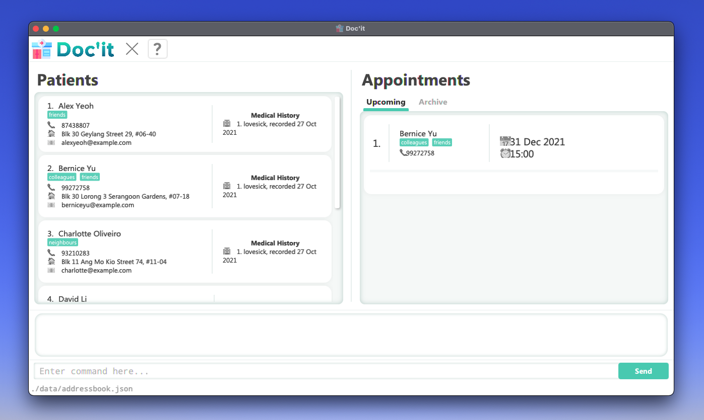

`Doc’it` provides a centralised platform for authorised staff from small family clinics to view, update, and onboard
patient records, solving the inefficient paper records and files used today. With `Doc’it`, small family clinics can
reduce man-hours in managing paper files, translating this saved time into better front-line care services.

#### Table of Contents

1. [Quick Start](#quick-start)
2. [Overview of Features](#overview-of-features)
    1. [General Commands](#general-commands)
       - [Clear all records](#clear-all-records-doc-clear)
       - [Help](#help-doc-help)
       - [Exit the program](#exit-the-program-doc-exit)
    2. [Patient Commands](#patient-commands)
       - [Add a patient](#add-a-patient-pt-add)
       - [List all patients](#list-all-patients-pt-list)
       - [Edit a patient](#edit-a-patient-pt-edit)
       - [Delete a patient](#delete-a-patient-pt-delete)
    3. [Appointment Commands](#appointment-commands)
       - [Add an appointment](#add-an-appointment-apmt-add)
       - [List all appointments](#list-all-appointments-apmt-list)
       - [Edit an appointment](#edit-an-appointment-apmt-edit)
       - [Delete an appointment](#delete-an-appointment-apmt-delete)
       - [Archive an appointment](#archive-an-appointment-apmt-archive)
    4. Upcoming Commands
       - Help
       - Clear all entries
       - Saving all data
       - Editing data files
       - Archiving data files
4. [FAQ](#faq)
5. [Command Summary](#command-summary)
6. [Glossary](#glossary)

--------------------------------------------------------------------------------------------------------------------

## Quick start
1. Ensure you have Java `11` or above installed in your Computer.

2. Download the latest `docit.jar` from [here](https://github.com/AY2122S1-CS2103-W14-1/tp/releases).

3. Copy the file to the folder you want to use as the _home folder_ for your `Doc’it`.

4. Double-click the file to start the app. The GUI similar to the below should appear in a few seconds. Note how the app contains some sample data.<br>
   <br>
   

5. Type the command in the command box and press Enter to execute it. e.g. typing **`help`** and pressing Enter will open the help window.<br>
   Some example commands you can try:

   * **`pt list`** : Lists all patients.

   * **`doc exit`** : Exits the app.

6. Refer to the **Features** section below for details of each command.

--------------------------------------------------------------------------------------------------------------------

## Overview of Features

<div markdown="block" class="alert alert-info">

This section provides a brief overview of `Doc’it`. The intention is for users to gain a better
understanding of basic functionalities of `Doc’it`, before diving into specific commands.

</div>

1. **General functionality**
   1. Clear all records
   2. Get Help
   3. Exit app
2. **Managing Patient Records**
   1. Create a new Patient Record
   2. View details of Patient Record
   3. Delete Patient Record
   4. Edit Patient Record
   5. Add Medical History from a Patient Record
   6. Delete Medical History of a Patient Record
   7. Find filtered patient records based on keywords
3. **Managing Patient Appointments**
   1. Create a new appointment
   2. View appointment
   3. Delete appointment
   4. Archive appointment
   5. List appointments
   6. Sort appointments (in order of urgency)
   7. Managing appointment prescriptions
      1. Add prescription
      2. Remove prescription

## Features

<div markdown="block" class="alert alert-info">

**:information_source: Notes about the command format:**<br>

* Words in `UPPER_CASE` are the parameters to be supplied by the user.<br>
  e.g. in `add n/NAME`, `NAME` is a parameter which can be used as `add n/John Doe`.

* Items in square brackets are optional.<br>
  e.g. `n/NAME [t/TAG]` can be used as `n/John Doe t/friend` or as `n/John Doe`.

* Items with `…`  after them can be used multiple times including zero times.<br>
  e.g. `[t/TAG]… ` can be used as ` ` (i.e. 0 times), `t/friend`, `t/friend t/family` etc.

* Parameters can be in any order.<br>
  e.g. if the command specifies `n/NAME p/PHONE_NUMBER`, `p/PHONE_NUMBER n/NAME` is also acceptable.

* If a parameter is expected only once in the command, but you specified it multiple times, only the last occurrence of the parameter will be taken.<br>
  e.g. if you specify `p/12341234 p/56785678`, only `p/56785678` will be taken.

* Extraneous parameters for commands that do not take in parameters (such as `help`, `list`, `exit` and `clear`) will be ignored.<br>
  e.g. if the command specifies `help 123`, it will be interpreted as `help`.

* `INDEX` must a positive integer of the given item in the panel.

* `DATETIME` must be in the format `yyyy-m-d HHmm` for all commands.<br>
  e.g. `2021-10-28-1530` indicates 28 Oct 2021 at 3.30pm

</div>

--------------------------------------------------------------------------------------------------------------------

## General Commands

### Clear all records: `doc clear`

Clears all patient records and information. This is an irreversible operation.

Format: `doc clear`

---

### Help: `doc help`

Shows the user manual for `Doc’it` explaining how to access the help page.

Format: `doc help`

---

### Exit the program: `doc exit`

Exits the program.

Format: `doc exit`

---

## Patient Commands
A patient is the primary entity in `Doc’it`. This section documents how to perform CRUD operations on patient
records. Do not that _all_ patient-related commands have `pt` in front of them.

### Add a patient: `pt add`

Creates a new patient record.

**Format:** `pt add n/FULL_NAME m/[MEDICAL_HISTORY]`

- `MEDICAL_HISTORY` is optional; if `MEDICAL_HISTORY` is not given, an empty text will be used

**Examples:**
- `pt add n/Joshen Lim`
- `pt add n/Joshen Lim m/lovesick`

**Expected Outcome:**
```
New patient created: Joshen Lim; Patient ID: 0001
```

---

### List all patients: `pt list`

Shows a list of all patients in the record system.

Format: `pt list`

---

### Edit a patient: `pt edit`

Edits the details of a specified patient.

**Format:** `pt edit INDEX [n/NAME] [p/PHONE_NUMBER] [e/EMAIL] [a/ADDRESS] [t/TAG] ...`
- All fields are optional but if stated, must not be null or empty
- `INDEX` is compulsory when making an edit to patient details

**Examples:**
- `pt edit 1 n/Joshen Tan m/Heartbreak`

**Expected outcome:** <br>
```
Successfully edited patient details:
Before:
Index: 1
Name: Joshen Lim
Medical History: Lovesick

After:
Index: 1
Name: Joshen Tan
Medical History: Heartbreak
```
---

### Delete a patient: `pt delete`

Deletes a patient record, including all information about the patient.

**Format:** `pt delete INDEX`

- Deletes the patient at the specified `INDEX` (one-indexed).

**Examples:**
- `pt delete 1`

**Expected Outcome:**
```
Deleted the following patient from records:
Patient Name: Joshen Lim
Patient ID: 1
```

---

### Add a Medical History: `pt ma 1 m/diabetes`

Adds a medical history to the Patient Record, saving the medical history and ```today``` as the date of entry.

**Format:** `pt ma INDEX m/[medical history]`

- Adds a medical history to the patient at the specified `INDEX` (one-indexed).

**Examples:**
- `pt ma INDEX m/diabetes`

**Expected Outcome:**
```
Updated: 
Alex Yeoh; Phone: 87438807; Email: alexyeoh@example.com; Address: Blk 30 Geylang Street 29, #06-40; Tags: [friends]; Medical History: diabetes, recorded 28 Oct 2021, high blood pressure, recorded 28 Oct 2021, diabetes, recorded 28 Oct 2021
```

---

### Delete a Medical History: `pt md 1 i/1`

Deletes a medical history to the Patient Record.

**Format:** `pt md INDEX i/MEDICAL_HISTORY_INDEX`

- Deletes a medical history from the patient at the specified `INDEX` (one-indexed). The entry deleted is specified by the `MEDICAL_HISTORY_INDEX`

**Examples:**
- `pt md 1 i/1`

**Expected Outcome:**
```
Updated: 
Updated: 
Alex Yeoh; Phone: 87438807; Email: alexyeoh@example.com; Address: Blk 30 Geylang Street 29, #06-40; Tags: [friends]; Medical History: high blood pressure, recorded 28 Oct 2021, diabetes, recorded 28 Oct 2021
```


---

### Find a Patient from keywords with Name or Medical History: `pt find [keywords...]`

Finds all patients that match any one of the keywords listed

**Format:** `pt find [keywords...]`

- Finds all patients that match any one of the keywords listed.

**Examples:**
- `pt find Alex David diabetes high blood pressure`

**Expected Outcome:**
```
4 patients listed!
```

---

## Appointment Commands
A patient in `Doc’it` may have appointments to visit the clinic.

In the Appointments panel, upcoming appointments are shown in the Upcoming tab, and past appointments are archived in the Archived tab.

One appointment stores these details:
* Index of patient: The index of an existing patient in the Patients panel
* Date and time: The date and time of the appointment

>:information_source: All appointment-related commands have the keyword `apmt` in front of them.
These commands modify the Appointments panel of `Doc’it`.

## Add an appointment: `apmt add`
Adds an appointment for the patient at the specified index in the Patients panel.

**Format:** `apmt add i/PATIENT_INDEX d/DATETIME`

- `PATIENT_INDEX`: Index of patient who should have this appointment
- `DATETIME`: Date and time of appointment in format `yyyy-m-d HHmm`

**Examples:**
* `apmt add i/1 d/2021-10-05 1500`  Adds appointment on 5 Oct 2021 at 3pm to patient at index 1.
* `apmt add i/2 d/2022-12-31 0700`  Adds appointment on 31 Dec 2022 at 7am to patient at index 2.

## List all appointments: `apmt list`
Shows a list of all appointments of all patients in `Doc’it`.

**Format:** `apmt list`

**Example Usage:**
```
apmt list
```

**Expected Outcome:**
```
Listed all appointments.
```

### Edit an appointment: `apmt edit`

Edits the details of an appointment at the specified index in the Appointments panel.

**Format:** `apmt edit APMT_INDEX [i/PATIENT_INDEX] [d/DATETIME]`

- `APMT_INDEX`: Index of appointment in the Appointments panel
- `PATIENT_INDEX`: Index of patient who should have this appointment
- `DATETIME`: Date and time of appointment in format `yyyy-m-d HHmm`
- At least one of the optional fields should be present

> :bulb: Use `i/PATIENT_INDEX` to change whose appointment it belongs to. <br>
> e.g. `apmt edit 1 i/2` modifies the first appointment to belong to the patient at index 2

**Examples:**
- `apmt edit 1 i/2`
- `apmt edit 1 d/2021-10-28 1500`
- `apmt edit 1 i/1 d/2021-10-28 1500`

---


## Delete an appointment: `apmt delete`
Deletes the appointment at the specified index in the Appointments panel.

**Format:** `apmt delete INDEX`
* Deletes the appointment at the specified INDEX.
* The index refers to the index number shown in the displayed appointment list.
* The index must be a positive integer 1, 2, 3, ...

**Examples:**
* `apmt list`  Lists all appointments.
* `apmt delete 1`  Deletes appointment at index 1.


## Archive an appointment: `apmt archive`
Archives an old appointment that is already past its date.

**Format:** `apmt archive INDEX`
* Archives the appointment at the specified INDEX.
* The index refers to the index number shown in the displayed appointment list.
* The index must be a positive integer 1, 2, 3, ...

**Examples:**
* `apmt archive 1`  Archives appointment at index 1.

**Expected Outcome:**
```
Archived Appointment: David Li; Phone: 91031282; Email: lidavid@example.com; Address: Blk 436 Serangoon Gardens Street 26, #16-43; Tags: [family]; Medical History: lovesick; Datetime: 2022-05-05 1300
```

## List all appointments: `apmt list`
Shows a list of all appointments.

**Format:** `apmt list`

**Examples:**
* `apmt list`  Lists all appointments.

**Expected Outcome:**
```
1. Patient Name: Joshen Lim | Appointment Date: 2021-10-05
2. Patient Name: Ian Yong | Appointment Date: 2021-10-06
```

## Sort all appointments: `apmt sort`
Shows a sorted list of all appointments

**Format:** `apmt sort`

**Examples:**
* `apmt sort`  Lists all appointments.

**Expected Outcome:**
```
1. Patient Name: Didymus Ne | Appointment Date: 2021-06-05
2. Patient Name: Hu Yuxin | Appointment Date: 2021-07-21
3. Patient Name: Joshen Lim | Appointment Date: 2021-10-05
4. Patient Name: Ian Yong | Appointment Date: 2021-10-06
```
## Add prescription: `apmt pa`
Adds a prescription to the designated appointment.


**Format:** `apmt pa i/APMT_INDEX n/MEDICINE_NAME v/MEDICINE_VOLUME d/MEDICINE_DURATION`
* The names of medicine added to the prescription list must be unique.

**Examples:**
* `apmt pa i/1 n/Penicillin v/400 ml d/2 times a week`

**Expected Outcome:**
```
New prescription added
Medicine: Penicillin
Volume: 400 ml
Duration: 2 times a week
```

## Delete prescription: `apmt pd`
Adds a prescription to the designated appointment.

**Format:** `apmt pa i/APMT_INDEX n/MEDICINE_NAME`

**Examples:**
* `apmt pd i/1 n/Penicillin `

**Expected Outcome:**
```
Deleted prescription
```
---

## Upcoming commands
1. Saving the data `[coming in v1.3]`
2. Editing the data file `[coming in v1.3]`
3. Archiving data files `[coming in v1.3]`

--------------------------------------------------------------------------------------------------------------------

## FAQ

**Q**: How do I transfer my data to another Computer?<br>
**A**: Install the app in the other computer and overwrite the empty data file it creates with the file that contains the data of your previous `Doc’it` home folder.

--------------------------------------------------------------------------------------------------------------------

## Command summary

### General Commands
| Command     | Format        |
|-------------|---------------|
| User Manual | `doc help`    |
| Clear       | `doc clear`   |
| Exit        | `doc exit`    |

### Patient-related Commands
| Command | Format                                                                  | Sample                                                                                                |
|---------|-------------------------------------------------------------------------|-------------------------------------------------------------------------------------------------------|
| Add     | `pt add n/NAME p/PHONE_NUMBER e/EMAIL a/ADDRESS [t/TAG]`                | `pt add n/James Ho p/22224444 e/jamesho@example.com a/123, Clementi Rd, 1234665 t/friend t/colleague` |
| Delete  | `pt delete INDEX`                                                       | `pt delete 3`                                                                                         |
| Edit    | `pt edit INDEX [n/NAME] [p/PHONE_NUMBER] [e/EMAIL] [a/ADDRESS] [t/TAG]` | `pt edit 2 n/James Lee e/jameslee@example.com`                                                        |
| Find    | `pt find n/NAME`                                                        | `pt find /nJames Jake`                                                                                |
| List    | `pt list`                                                               | -                                                                                                     |

### Appointment-related Commands
| Command | Format                  | Sample                    |
|---------|-------------------------|---------------------------|
| Add     | `apmt add INDEX d/DATETIME` | `apmt add 1 d/2021-10-05 1600` |
| Edit     | `apmt edit APMT_INDEX [i/PATIENT_INDEX] [d/DATETIME]` | `apmt edit 1 d/2021-10-05 1600` |
| Delete  | `apmt delete INDEX`     | `apmt delete 1`           |
| Archive | `apmt archive INDEX`    | `apmt archive 1`          |
| List    | `apmt list`             | -                         |

--------------------------------------------------------------------------------------------------------------------

## Glossary
| Term           | Definition                                                                                |
|----------------|-------------------------------------------------------------------------------------------|
| Appointment    | A scheduled consult between a patient and the clinic's doctor at an exact date and time. The doctor may or may not prescribe medication                            |
| Archive        | Storage for data that is non-urgent, e.g. appointment records that are past their date.   |
| Patient Record | A record of a patient's details, medical history, medication, appointment list, and name. |
| Prescription   | The issued medication/treatment for a patient along with a duration and volume.           |
| Expired Appointment | An appointment that is 24-hours past its scheduled time.                             |
